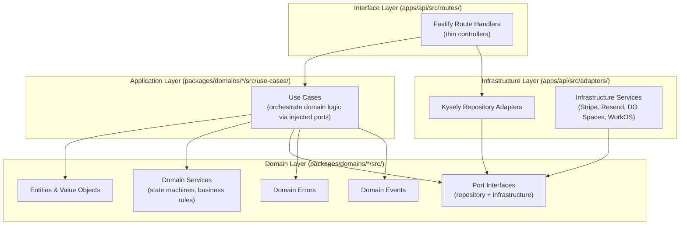
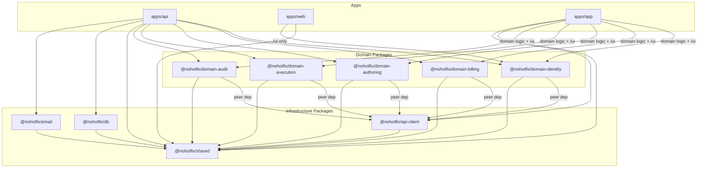

# Coding Architecture -- NoHotfix v1

_Extracted from [docs/development/technical-architecture.md](./technical-architecture.md). See also: [Domain Architecture](./domain-architecture.md) for bounded context internals, [Backend Architecture](./backend-architecture.md) for Fastify specifics, [Frontend Architecture](./frontend-architecture.md) for React/Next.js specifics._

---

## Table of Contents

1. [Architectural Pattern: Hexagonal (Ports and Adapters)](#architectural-pattern-hexagonal-ports-and-adapters)
2. [Layer Diagram](#layer-diagram)
3. [Monorepo Structure](#monorepo-structure)
4. [Package Dependency Graph](#package-dependency-graph)
5. [Dependency Rules](#dependency-rules)
6. [Coding Standards](#coding-standards)
7. [Key Architectural Decisions](#key-architectural-decisions)

---

## Architectural Pattern: Hexagonal (Ports and Adapters)

NoHotfix uses **Domain-Driven Design (DDD)** with a **Hexagonal Architecture** (Ports and Adapters), organized as a **modular monolith**. The 5 bounded contexts run within a single Fastify process but are strictly decoupled into separate packages.

### Core Principles

1. **Transport agnosticism**: Domain logic has zero knowledge of HTTP, Fastify, Express, or any web framework. It exports pure TypeScript functions and classes.
2. **Infrastructure agnosticism**: Domain packages define port interfaces (TypeScript interfaces) for all external dependencies (databases, third-party APIs, storage). They never import Kysely, pg, Stripe SDK, or any infrastructure library.
3. **Dependency injection**: Use cases accept their dependencies (repositories, services) as constructor or function parameters. The composition root in `apps/api` wires concrete implementations to port interfaces.
4. **Domain packages own their errors**: Each domain package defines its own error classes that extend a shared `DomainError` base class from `@nohotfix/shared`. The API's error handler maps these to HTTP status codes.
5. **Domain packages own their events**: Each domain package defines event types for cross-domain coordination. The event bus implementation lives in the API layer.
6. **Co-located UI**: Each domain package includes a `src/ui/` directory containing domain-specific React components and TanStack Query hooks. This UI layer is exported via a separate `/ui` entry point.

---

## Layer Diagram

```
Domain Layer  <--  Application Layer  <--  Infrastructure Layer  <--  Interface Layer
(entities,        (use cases)              (Kysely repos,             (Fastify routes,
 value objects,                             Stripe SDK,                HTTP handlers)
 domain services,                           Resend client,
 port interfaces)                           DO Spaces client)
```

Dependencies point **inward**. Domain logic never imports from infrastructure. Infrastructure implements domain-defined port interfaces.



---

## Monorepo Structure

```
nohotfix.com/
|-- pnpm-workspace.yaml
|-- turbo.json
|-- package.json                    # Root: workspace scripts, shared devDependencies
|-- .github/
|   |-- workflows/
|       |-- ci.yml                  # Lint, typecheck, test, build
|       |-- deploy-api.yml          # Deploy apps/api to DO App Platform
|       |-- deploy-web.yml          # Deploy apps/web to Vercel
|       |-- deploy-app.yml          # Deploy apps/app to Vercel
|
|-- apps/
|   |-- api/                        # Fastify 5 -- thin transport adapter layer
|   |-- web/                        # Next.js 15 -- landing pages + auth callback
|   |-- app/                        # React SPA -- thin shell (routing, layouts, page composition)
|   |-- app-e2e/                    # Playwright E2E tests for apps/app
|   |-- web-e2e/                    # Playwright E2E tests for apps/web
|
|-- packages/
|   |-- domains/                    # DDD bounded contexts (domain logic + co-located UI)
|   |   |-- identity/               # @nohotfix/domain-identity
|   |   |-- billing/                # @nohotfix/domain-billing
|   |   |-- authoring/              # @nohotfix/domain-authoring
|   |   |-- execution/              # @nohotfix/domain-execution
|   |   |-- audit/                  # @nohotfix/domain-audit
|   |
|   |-- shared/                     # @nohotfix/shared -- types, Zod schemas, error codes
|   |-- api-client/                 # @nohotfix/api-client -- ApiClient, ApiError, useApiQuery, useApiMutation
|   |-- db/                         # @nohotfix/db -- Kysely client, schema, migrations
|   |-- email/                      # @nohotfix/email -- React Email templates
|
|-- tooling/
|   |-- eslint/                     # Shared ESLint config
|   |-- typescript/                 # Shared tsconfig bases
|   |-- prettier/                   # Shared Prettier config
|
|-- docker-compose.yml              # Local PostgreSQL + OTel Collector + Jaeger + Prometheus
|-- .env.example                    # Required environment variables template
```

### PNPM Workspace Configuration

```yaml
# pnpm-workspace.yaml
packages:
  - 'apps/*'
  - 'packages/*'
  - 'packages/domains/*' # nested workspace -- each domain is a separate package
  - 'tooling/*'
```

_Rationale_: `packages/domains/*` is a nested workspace glob. Each domain directory (`packages/domains/identity/`, etc.) is a standalone PNPM package with its own `package.json`. This is necessary because `packages/*` only matches direct children, not nested directories.

### Turborepo Pipeline

```jsonc
// turbo.json
{
  "tasks": {
    "build": {
      "dependsOn": ["^build"],
      "outputs": ["dist/**", ".next/**", ".vite/**"],
    },
    "lint": {},
    "typecheck": {
      "dependsOn": ["^build"],
    },
    "test": {
      "dependsOn": ["^build"],
    },
    "test:e2e": {
      "dependsOn": ["build"],
    },
    "db:migrate": {
      "cache": false,
    },
    "dev": {
      "cache": false,
      "persistent": true,
    },
    "format": {
      "cache": false,
    },
  },
}
```

_Rationale_: `typecheck` and `test` depend on `^build` because domain packages and `packages/shared` types must be compiled before downstream apps can typecheck. `db:migrate` is never cached because it mutates external state.

**Build order** (determined by Turborepo from the dependency graph):

1. `packages/shared` (no deps)
2. `packages/api-client` (depends on shared)
3. `packages/domains/*` (depends on shared, peer-depends on api-client) -- all 5 build in parallel
4. `packages/db`, `packages/email` (depends on shared) -- parallel with domains
5. `apps/api` (depends on domains + db + email + shared)
6. `apps/web`, `apps/app` (depends on shared + api-client + domains) -- parallel

---

## Package Dependency Graph



**Key observations:**

- Domain packages depend on `@nohotfix/shared` and peer-depend on `@nohotfix/api-client` (for UI hooks that use `useApiQuery`/`useApiMutation`). They NEVER depend on `@nohotfix/db`, Fastify, Kysely, or any infrastructure package.
- `apps/api` imports domain logic entry points (`@nohotfix/domain-*/`) only, never the `/ui` entry point.
- `apps/app` imports both domain logic and UI from all 5 domain packages.
- Domain packages NEVER depend on each other. Cross-domain coordination uses events or API-layer orchestration.
- The `/ui` subpath within a domain package may import from its own root entry point, but the reverse is never true.

---

## Dependency Rules

These rules are enforced by convention and ESLint import restrictions:

| Package                                  | May import from                                                                                | NEVER imports from                                       |
| ---------------------------------------- | ---------------------------------------------------------------------------------------------- | -------------------------------------------------------- |
| `packages/shared`                        | Nothing (leaf package)                                                                         | `apps/*`, other packages                                 |
| `packages/api-client`                    | `packages/shared`                                                                              | `apps/*`, `packages/domains/*`, `packages/db`            |
| `packages/db`                            | `packages/shared`                                                                              | `apps/*`, `packages/domains/*`                           |
| `packages/email`                         | `packages/shared`                                                                              | `apps/*`, `packages/domains/*`                           |
| `packages/domains/*/src/` (domain logic) | `packages/shared` only                                                                         | `packages/db`, `packages/email`, other domains, `apps/*` |
| `packages/domains/*/src/ui/` (UI layer)  | Own domain root entry point, `packages/shared`, `@nohotfix/api-client` (peer dep)              | Other domains, `packages/db`, `apps/*`                   |
| `apps/api`                               | Domain logic (`@nohotfix/domain-*/`), infrastructure packages                                  | Domain UI (`/ui`), other `apps/*`                        |
| `apps/app`                               | Domain logic + UI (`@nohotfix/domain-*/` and `/ui`), `packages/shared`, `@nohotfix/api-client` | `packages/db`, `packages/email`, `apps/api`              |
| `apps/web`                               | `packages/shared`, selectively `@nohotfix/domain-*/ui`                                         | `packages/db`, `apps/api`, `apps/app`                    |

---

## Coding Standards

### Naming Conventions

| What                               | Convention                                      | Example                                                |
| ---------------------------------- | ----------------------------------------------- | ------------------------------------------------------ |
| **Directories**                    | `kebab-case`                                    | `run-state-machine/`, `spec-library/`                  |
| **TypeScript files**               | `kebab-case.ts`                                 | `run-state-machine.ts`, `membership-service.ts`        |
| **React component files**          | `PascalCase.tsx`                                | `RunOverview.tsx`, `DecisionDialog.tsx`                |
| **Test files (API)**               | Colocated as `<name>.spec.ts`                   | `run-state-machine.spec.ts`                            |
| **Test files (domains)**           | In `entities/__tests__/<name>.test.ts`          | `email.test.ts`, `organisation.test.ts`                |
| **Entity classes**                 | `PascalCase` + `Entity` suffix                  | `OrganisationEntity`, `UserEntity`, `MembershipEntity` |
| **Entity props interfaces**        | `PascalCase` + `Props` suffix                   | `OrganisationProps`, `UserProps`                       |
| **Value Object classes**           | `PascalCase` (no suffix)                        | `Email`, `Role`, `OrganisationName`, `DisplayName`     |
| **Value Object type aliases**      | `PascalCase` + `Value` suffix                   | `RoleValue` (for the union type `'admin' \| 'member'`) |
| **Use-case input interfaces**      | `PascalCase` + `Command` suffix                 | `CreateOrganisationCommand`, `StartRunCommand`         |
| **Use-case dependency interfaces** | `PascalCase` + `Deps` suffix                    | `CreateOrganisationDeps`, `StartRunDeps`               |
| **Use-case return types**          | Shared `*Dto` from `@nohotfix/shared`           | `OrganisationDto`, `UpdateUserProfileDto`              |
| **Zod request schemas**            | `PascalCase` + `RequestSchema` suffix           | `CreateOrganisationRequestSchema`                      |
| **Zod DTO schemas**                | `PascalCase` + `DtoSchema` suffix               | `OrganisationDtoSchema`, `UserDtoSchema`               |
| **Repository interfaces**          | `PascalCase` + `Repository` suffix              | `OrganisationRepository`, `UserRepository`             |
| **Package names**                  | `@nohotfix/domain-<context>`                    | `@nohotfix/domain-authoring`                           |
| **Variables and functions**        | `camelCase`                                     | `runStateMachine`, `createPlaybook()`                  |
| **Types and interfaces**           | `PascalCase`                                    | `RunRepository`, `StartRunCommand`                     |
| **Enums**                          | `PascalCase` with `SCREAMING_SNAKE_CASE` values | `ErrorCode.EXEC_RUN_IMMUTABLE`                         |
| **Constants**                      | `SCREAMING_SNAKE_CASE`                          | `TERMINAL_STATUSES`                                    |
| **Database columns**               | `snake_case`                                    | `org_id`, `created_at`, `spec_library_id`              |
| **Database tables**                | `snake_case` (plural)                           | `organisations`, `run_specs`, `playbook_sections`      |

### Barrel Files Policy

Each domain package exposes **two** public barrel files via dual entry points in `package.json`:

- `src/index.ts` -- domain logic exports: entities, port interfaces, use case functions, domain service classes, domain error classes, domain event types, and key type aliases. Imported as `@nohotfix/domain-<ctx>`.
- `src/ui/index.ts` -- UI exports: React components and hooks. Imported as `@nohotfix/domain-<ctx>/ui`.

Internal modules within a domain package import **directly** (no intra-package barrels beyond the two entry points). The `ui/` barrel may re-export domain types needed by component props, but domain logic barrels never export from `ui/`.

### Import Rules

- Always use explicit file extensions in imports: `.js` (for TypeScript files compiled to JS)
- Use path aliases where configured, but prefer relative imports within a package
- No circular imports -- enforce via ESLint `import/no-cycle`
- No default exports -- use named exports exclusively (except for Fastify plugins which conventionally use default exports)

### Error Code Format

All error codes follow the format `DOMAIN_CATEGORY_SPECIFIC`:

```typescript
// packages/shared/src/errors/codes.ts
export enum ErrorCode {
  // Auth errors
  AUTH_SESSION_EXPIRED = 'AUTH_SESSION_EXPIRED',
  AUTH_ROLE_INSUFFICIENT = 'AUTH_ROLE_INSUFFICIENT',
  AUTH_LAST_ADMIN = 'AUTH_LAST_ADMIN',

  // Billing errors
  BILL_SUB_EXPIRED = 'BILL_SUB_EXPIRED',
  BILL_WEBHOOK_INVALID = 'BILL_WEBHOOK_INVALID',
  BILL_WEBHOOK_DUPLICATE = 'BILL_WEBHOOK_DUPLICATE',

  // Authoring errors
  AUTHOR_PLAYBOOK_NOT_FOUND = 'AUTHOR_PLAYBOOK_NOT_FOUND',
  AUTHOR_SPEC_ARCHIVED = 'AUTHOR_SPEC_ARCHIVED',
  AUTHOR_SYNC_CONFLICT = 'AUTHOR_SYNC_CONFLICT',

  // Execution errors
  EXEC_RUN_IMMUTABLE = 'EXEC_RUN_IMMUTABLE',
  EXEC_RUN_INVALID_TRANSITION = 'EXEC_RUN_INVALID_TRANSITION',
  EXEC_SPEC_ARTIFACTS_INCOMPLETE = 'EXEC_SPEC_ARTIFACTS_INCOMPLETE',
  EXEC_DECISION_JUSTIFICATION_REQUIRED = 'EXEC_DECISION_JUSTIFICATION_REQUIRED',

  // System errors
  SYS_INTERNAL = 'SYS_INTERNAL',
  SYS_DATABASE = 'SYS_DATABASE',
}
```

Domain-specific error classes extend the shared `DomainError` base:

```typescript
// packages/shared/src/errors/domain-error.ts
export class DomainError extends Error {
  constructor(
    public readonly code: ErrorCode,
    message: string,
    public readonly statusCode: number,
    public readonly details?: Record<string, unknown>,
  ) {
    super(message);
    this.name = 'DomainError';
    Object.setPrototypeOf(this, new.target.prototype);
  }
}
```

### Testing Conventions

- **Unit tests (API)**: Vitest, colocated as `*.spec.ts` next to the source file (vitest config: `src/**/*.spec.ts`)
- **Unit tests (domain packages)**: Vitest, in `entities/__tests__/*.test.ts` directories (vitest config: `src/**/*.test.ts`)
- **Integration tests**: Vitest, in `__tests__/` directories within `apps/api`
- **E2E tests**: Playwright, in `apps/app-e2e/` and `apps/web-e2e/`
- All test commands use `--passWithNoTests` flag (zero tests = success, not failure)
- Domain package tests are pure unit tests -- no HTTP, no database, no external services, no mocking
- Domain test files are excluded from the TypeScript build via `tsconfig.json` `"exclude": ["src/**/*.test.ts"]`

### TypeScript Configuration

Shared base configs live in `tooling/typescript/`:

| Config       | Used by                              | Purpose                                               |
| ------------ | ------------------------------------ | ----------------------------------------------------- |
| `base.json`  | All packages                         | Strict mode, ESM target, path resolution              |
| `react.json` | `apps/app`, `apps/web`, domain `ui/` | Extends `base.json`, adds JSX transform (`react-jsx`) |
| `node.json`  | `apps/api`, `packages/db`            | Extends `base.json`, adds Node.js types               |

**Key TypeScript settings:**

- `strict: true` -- always
- `jsx: "react-jsx"` -- no `import React` needed in `.tsx` files
- `moduleResolution: "bundler"` for Vite apps, `"node16"` for Node.js packages
- `verbatimModuleSyntax: true` -- enforces explicit `type` imports

### Tooling Configs

- **ESLint**: Three presets in `tooling/eslint/` -- `base.js`, `react.js`, `node.js`
- **Prettier**: Single shared config in `tooling/prettier/`
- **Package name**: `@nohotfix/eslint-config`, `@nohotfix/prettier-config`, `@nohotfix/typescript-config`

---

## Key Architectural Decisions

| ID      | Decision                                                 | Rationale                                                                                          |
| ------- | -------------------------------------------------------- | -------------------------------------------------------------------------------------------------- |
| ADR-001 | Two frontend apps: Next.js (public) + React SPA (auth'd) | Landing pages need SSR for SEO; the authenticated app is a pure SPA. Separating keeps each simple. |
| ADR-002 | Kysely query builder, no ORM                             | Full type safety end-to-end, predictable queries, no N+1 surprises. Raw SQL only in migrations.    |
| ADR-003 | WorkOS for all auth                                      | Eliminates security burden. Native SSO/SAML support for future enterprise.                         |
| ADR-004 | Presigned PUT for artifact uploads                       | Avoids proxying large files through the API server.                                                |
| ADR-005 | Snapshot-based run isolation                             | Guarantees run immutability. Deep-copy on run start, permanently decoupled from template.          |
| ADR-006 | SWR polling 5s (v1), SSE in v2                           | Simplicity. 5-second eventual consistency acceptable for concurrent testers.                       |
| ADR-007 | Structured error codes as Sentry fingerprints            | Deterministic error grouping, client-side programmatic handling, searchable taxonomy.              |
| ADR-008 | "Keep local" as sole divergence (no overrides JSONB)     | Single unambiguous mechanism. Detach cleanly, no merge-at-read-time.                               |
| ADR-009 | Separate Vercel projects on distinct subdomains          | Independent deployments, clean security boundary for cookie scoping.                               |
| ADR-010 | Domain packages decoupled from transport (Hexagonal)     | Independent testing, frontend reuse of domain logic + UI, future transport flexibility.            |

For full rationale on each ADR, see [docs/development/technical-architecture.md](./technical-architecture.md).

---

## Cross-Domain Communication

Domains NEVER import from each other. Cross-domain interactions are handled via two mechanisms:

### 1. Domain Events (async, decoupled)

Domain packages define event types. The API layer implements the event bus and wires event handlers.

```typescript
// packages/domains/execution/src/events/decision-recorded.ts
export interface DecisionRecordedEvent {
  type: 'execution.decision_recorded';
  payload: {
    runId: string;
    orgId: string;
    decision: 'go' | 'no_go';
    decidedBy: string;
  };
}

// apps/api/src/event-bus.ts -- wires cross-domain event handlers
eventBus.on('execution.decision_recorded', async (event) => {
  await auditUseCases.recordRunDecision(event.payload);
  await emailService.sendDecisionNotification(event.payload);
});
```

### 2. Orchestration in the API Layer (sync, explicit)

When a use case requires data from multiple domains, the API route handler orchestrates the calls:

```typescript
// apps/api/src/routes/execution.ts
fastify.post('/api/runs', async (request) => {
  const playbook = await authoringUseCases.getPlaybook(request.orgContext!.orgId, request.body.playbookId);
  if (!playbook) throw new AuthorPlaybookNotFoundError();

  const result = await db.transaction().execute(async (tx) => {
    return executionUseCases.startRun(request.body, tx);
  });

  return result;
});
```

---

## Composition Root

The composition root in `apps/api/src/composition-root.ts` wires all domain services and use cases with their concrete infrastructure adapters:

```typescript
// apps/api/src/composition-root.ts (excerpt)
export function createCompositionRoot(db: Kysely<Database>): CompositionRoot {
  // Repositories (Kysely adapters implementing domain port interfaces)
  const runRepo = new KyselyRunRepository(db);
  const playbookRepo = new KyselyPlaybookRepository(db);
  // ... all 14 repositories

  // Infrastructure adapters
  const presignedUrlAdapter = new PresignedUrlAdapter();

  // Domain services (pure domain logic, injected with repositories)
  const runStateMachine = new RunStateMachine();
  const snapshotService = new SnapshotService();
  // ... all domain services

  return {
    /* all repositories, services, and adapters */
  };
}
```

The composition root is created once at server startup and decorated onto the Fastify instance as `fastify.root`. Route handlers access it via `request.server.root`.

See [Backend Architecture](./backend-architecture.md) for full details on the composition root and how it integrates with the Fastify plugin lifecycle.
