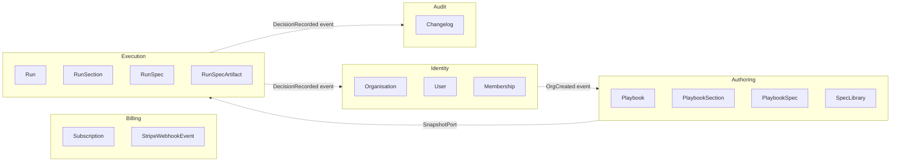
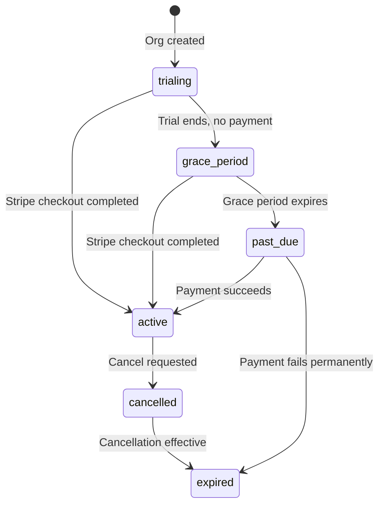
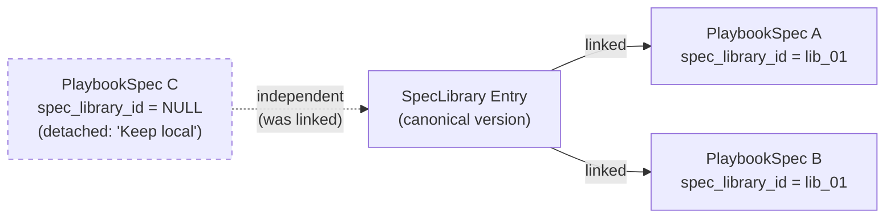
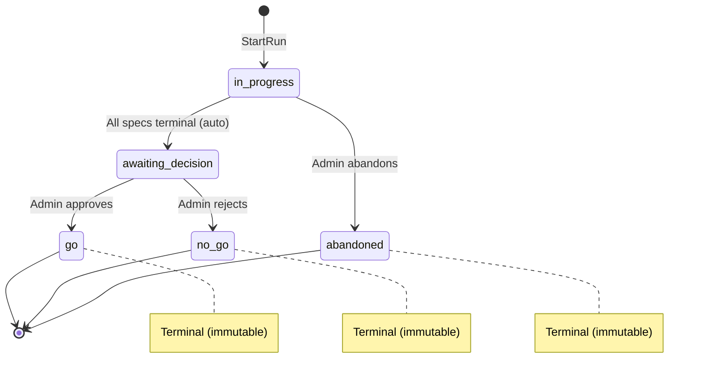
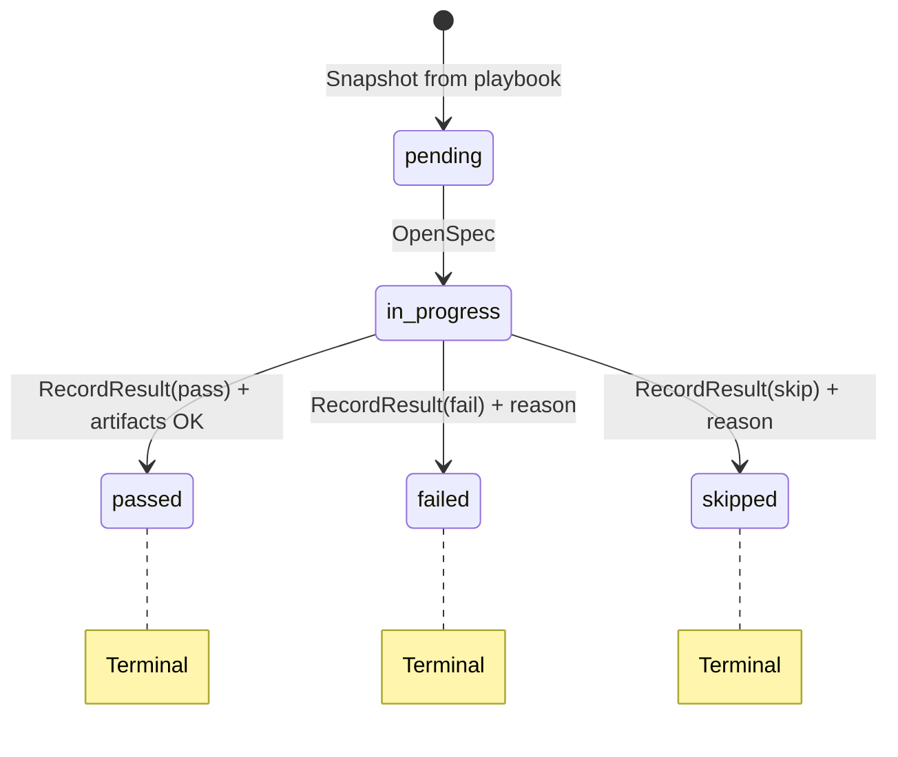

# Domain Architecture -- NoHotfix v1

_Extracted from [docs/development/technical-architecture.md](./technical-architecture.md). See also: [Coding Architecture](./coding-architecture.md) for conventions, [Backend Architecture](./backend-architecture.md) for how domains integrate with Fastify, [Frontend Architecture](./frontend-architecture.md) for how domain UI is consumed, [Database Design](./database-diagram.md) for table schemas._

---

## Bounded Contexts Overview

NoHotfix's domain is organized into **5 bounded contexts**, each implemented as an independent package under `packages/domains/`:



| Context       | Package                      | Responsibility                                           | Key Aggregates                                               |
| ------------- | ---------------------------- | -------------------------------------------------------- | ------------------------------------------------------------ |
| **Identity**  | `@nohotfix/domain-identity`  | Users, organisations, memberships, roles                 | `Organisation`, `User`, `Membership`                         |
| **Billing**   | `@nohotfix/domain-billing`   | Subscription lifecycle, Stripe integration               | `Subscription`, `StripeWebhookEvent`                         |
| **Authoring** | `@nohotfix/domain-authoring` | Playbook templates, spec library, section/spec structure | `Playbook`, `PlaybookSection`, `PlaybookSpec`, `SpecLibrary` |
| **Execution** | `@nohotfix/domain-execution` | Active runs, spec execution, artifacts, decisions        | `Run`, `RunSection`, `RunSpec`, `RunSpecArtifact`            |
| **Audit**     | `@nohotfix/domain-audit`     | Read-only run history, changelog records                 | `Changelog`                                                  |

**Key rule**: Domains NEVER import from each other. Cross-domain coordination is handled via domain events or API-layer orchestration. See [Cross-Domain Communication](#cross-domain-communication).

---

## Domain Package Architecture

### Standardized Internal Layout

Every domain package follows this directory structure:

```
packages/domains/<context>/
|-- package.json                    # name: @nohotfix/domain-<context>
|-- tsconfig.json
|-- src/
    |-- index.ts                    # Public API barrel (domain logic exports)
    |
    |-- entities/                   # Domain entities with factory methods and invariant checks
    |-- services/                   # Domain services (pure business logic, no I/O)
    |-- use-cases/                  # Application use cases (orchestrate services via injected ports)
    |-- ports/                      # Repository + infrastructure port interfaces
    |-- errors/                     # Domain-specific error classes extending DomainError
    |-- events/                     # Domain event type definitions
    |-- types.ts                    # Domain-internal value objects, type aliases
    |
    |-- ui/                         # Co-located React UI (separate entry point: /ui)
        |-- index.ts                # Public UI barrel (component + hook exports)
        |-- components/             # Domain-specific React components
        |-- hooks/                  # TanStack Query hooks for domain API endpoints
```

### Modeling New Features: Entity & Value Object Pattern (Reference Implementation)

When building entities and value objects for any bounded context, follow the canonical patterns established in the Identity context (`packages/domains/identity/src/entities/`). This section is the authoritative guide.

#### Value Objects

Value Objects enforce domain invariants at construction time. They are immutable, compared by value, and use a private constructor + static factory pattern.

**File location:** `packages/domains/<context>/src/entities/value-objects/<name>.ts`

**Canonical pattern:**

```typescript
// packages/domains/identity/src/entities/value-objects/email.ts (actual code)
export class Email {
  private constructor(readonly value: string) {}

  static create(raw: string): Email {
    if (!raw || typeof raw !== 'string') {
      throw new Error('Email must be a non-empty string');
    }
    const trimmed = raw.trim().toLowerCase();
    if (!/^[^\s@]+@[^\s@]+\.[^\s@]+$/.test(trimmed)) {
      throw new Error(`Invalid email format: ${raw}`);
    }
    return new Email(trimmed);
  }

  equals(other: Email): boolean {
    return this.value === other.value;
  }

  toString(): string {
    return this.value;
  }
}
```

**Rules:**

- `private constructor(readonly value: T)` — prevents creation without validation
- `static create(raw)` — validates input, normalizes (trim, lowercase, etc.), and returns a new instance. Throws a descriptive `Error` on invalid input
- `equals(other)` — structural equality comparison
- `toString()` — returns the underlying primitive
- VOs are always immutable — no setter methods, no mutation
- Each VO gets its own file in `value-objects/` with a barrel `index.ts`

**When to create a VO:** Any domain primitive that has validation rules, normalization, or restricted values. Examples: `Email`, `Role`, `OrganisationName`, `RunStatus`, `Severity`, `ArtifactType`.

**Enum-like VOs** (restricted set of values) use convenience factory methods:

```typescript
// packages/domains/identity/src/entities/value-objects/role.ts (actual code)
export type RoleValue = 'admin' | 'member';

export class Role {
  private constructor(readonly value: RoleValue) {}

  static create(raw: string): Role {
    /* validates against allowed set */
  }
  static admin(): Role {
    return new Role('admin');
  }
  static member(): Role {
    return new Role('member');
  }

  isAdmin(): boolean {
    return this.value === 'admin';
  }
  equals(other: Role): boolean {
    return this.value === other.value;
  }
  toString(): string {
    return this.value;
  }
}
```

#### Entity Classes

Entities are the aggregate roots and domain objects with identity. They are immutable — mutation methods return new instances.

**File location:** `packages/domains/<context>/src/entities/<name>.ts`

**Canonical pattern:**

```typescript
// packages/domains/identity/src/entities/organisation.ts (actual code)
import { OrganisationName } from './value-objects/organisation-name.js';

export interface OrganisationProps {
  id: string;
  name: OrganisationName;
  createdAt: Date;
  updatedAt: Date;
}

export class OrganisationEntity {
  readonly id: string;
  readonly name: OrganisationName;
  readonly createdAt: Date;
  readonly updatedAt: Date;

  private constructor(props: OrganisationProps) {
    this.id = props.id;
    this.name = props.name;
    this.createdAt = props.createdAt;
    this.updatedAt = props.updatedAt;
  }

  // Factory: create NEW entity (sets timestamps, validates via VOs)
  static create(params: { id: string; name: string }): OrganisationEntity {
    const now = new Date();
    return new OrganisationEntity({
      id: params.id,
      name: OrganisationName.create(params.name),
      createdAt: now,
      updatedAt: now,
    });
  }

  // Factory: reconstitute from persistence (VOs already constructed)
  static reconstitute(props: OrganisationProps): OrganisationEntity {
    return new OrganisationEntity(props);
  }

  // Mutation: returns new instance (immutable)
  rename(newName: string): OrganisationEntity {
    return new OrganisationEntity({
      id: this.id,
      name: OrganisationName.create(newName),
      createdAt: this.createdAt,
      updatedAt: new Date(),
    });
  }
}
```

**Rules:**

- `private constructor(props: XxxProps)` — prevents creation without going through a factory
- `static create(params)` — creates a new entity from raw primitives, wraps them in VOs, sets timestamps. Used by use cases when creating new domain objects
- `static reconstitute(props)` — recreates an entity from persistence. Accepts already-constructed VOs (the repository adapter builds them). No additional validation beyond VO construction
- Mutation methods (e.g., `rename()`, `updateProfile()`, `changeRole()`) — return a **new instance** with updated fields. The original is unchanged (immutable entity pattern)
- Export a `XxxProps` interface for the constructor shape — used by `reconstitute()` and by repository adapters
- Entity fields are `readonly` — enforced at the TypeScript level
- Entities hold VOs as properties (not raw strings). Access the underlying value via `.value` (e.g., `entity.name.value`)

#### Props Interface Export Convention

Each entity file exports both the class and its props interface:

```typescript
export interface UserProps {
  /* ... VOs and primitives ... */
}
export class UserEntity {
  /* ... */
}
```

The props interface is used by:

- Repository adapters calling `XxxEntity.reconstitute(props)`
- Test code constructing entities directly

#### Barrel Exports

```
entities/
|-- value-objects/
|   |-- email.ts
|   |-- role.ts
|   |-- ...
|   |-- index.ts           # Exports all VOs + RoleValue type
|
|-- organisation.ts
|-- user.ts
|-- membership.ts
|-- index.ts                # Exports all entities, props interfaces, AND re-exports VOs
```

The `entities/index.ts` barrel re-exports everything from `value-objects/index.ts`, so consumers can import both entities and VOs from a single path.

The domain's root `src/index.ts` re-exports from `entities/index.ts` for the public API.

#### Repository Port Pattern (Entity-Typed)

Repository port interfaces return entity classes, but accept raw primitives as input. The adapter is responsible for constructing entities via `reconstitute()`:

```typescript
// packages/domains/identity/src/ports/repositories.ts (actual code)
import type { UserEntity } from '../entities/user.js';

export interface UserRepository {
  findById(id: string): Promise<UserEntity | undefined>;
  findByWorkosId(workosUserId: string): Promise<UserEntity | undefined>;
  upsertByWorkosId(data: { workosUserId: string; email: string; displayName?: string }): Promise<UserEntity>;
  update(id: string, data: { displayName?: string }): Promise<UserEntity | undefined>;
}
```

**Key rule:** Command parameters are always primitives (the repo adapter wraps them in VOs internally). Return types are always entity classes.

#### Kysely Repository Adapter Pattern

```typescript
// apps/api/src/adapters/repositories/identity.ts (pattern)
import { DisplayName, Email, UserEntity, WorkosUserId } from '@nohotfix/domain-identity';

export class KyselyUserRepository implements UserRepository {
  // Reconstitute entity from DB row
  private toDomain(row: UsersTable): UserEntity {
    return UserEntity.reconstitute({
      id: row.id,
      workosUserId: WorkosUserId.create(row.workos_user_id),
      email: Email.create(row.email),
      displayName: row.display_name ? DisplayName.create(row.display_name) : null,
      createdAt: row.created_at,
      updatedAt: row.updated_at,
    });
  }

  // Extract primitives for persistence
  async upsertByWorkosId(data: { workosUserId: string; email: string }) {
    const row = await this.db.insertInto('users').values({ workos_user_id: data.workosUserId, email: data.email }).onConflict(/* ... */).returningAll().executeTakeFirstOrThrow();
    return this.toDomain(row);
  }
}
```

#### Use Case Boundary Rule

**Entities do NOT leak past the use case boundary.** Use cases return shared DTO types from `@nohotfix/shared` (defined as Zod `*DtoSchema`), not entity classes. Route handlers pass through the DTO directly (`reply.send(result)`):

```typescript
// Use case returns a plain DTO
export interface GetCurrentUserDto {
  orgId: string;
  role: 'admin' | 'member';
  displayName?: string;
  // ... plain types only
}
```

#### Backward Compatibility When Migrating from Interfaces to Entities

When replacing plain interfaces in `types.ts` with entity classes, update `types.ts` to re-export the entity class as a type alias:

```typescript
// packages/domains/identity/src/types.ts (actual code after migration)
export type { OrganisationEntity as Organisation } from './entities/organisation.js';
export type { UserEntity as User } from './entities/user.js';
export type { MembershipEntity as Membership } from './entities/membership.js';
```

This allows existing imports of `Organisation`, `User`, `Membership` to continue working.

#### Testing Entities and Value Objects

Tests live in `packages/domains/<context>/src/entities/__tests__/` as `<name>.test.ts` files. They are **pure unit tests** — no mocking, no I/O.

**What to test for Value Objects:**

- Valid input creates successfully
- Invalid input throws with descriptive message
- Normalization (trimming, lowercasing)
- Boundary conditions (min/max length, edge cases)
- `equals()` with same and different values
- `toString()` returns the underlying value

**What to test for Entities:**

- `create()` sets timestamps and wraps primitives in VOs
- `reconstitute()` returns entity from props
- Mutation methods return a **new instance** (original unchanged)
- Mutation methods validate via VOs (invalid input throws)
- Domain helper methods (e.g., `isAdmin()`)

**Vitest config:** Each domain package needs `vitest.config.ts`:

```typescript
import { defineConfig } from 'vitest/config';

export default defineConfig({
  test: { include: ['src/**/*.test.ts'], environment: 'node' },
});
```

**package.json:** Add `"test": "vitest run --passWithNoTests"` to scripts. Add `vitest` to devDependencies.

**tsconfig.json:** Exclude test files from build: `"exclude": ["node_modules", "dist", "src/**/*.test.ts"]`

#### Checklist: Modeling a New Feature's Entities

When implementing entities for a new bounded context (e.g., Authoring, Execution), follow this checklist:

1. **Identify Value Objects** — scan the `types.ts` interfaces for fields with validation rules or restricted values. Create a VO class for each.
2. **Create entity classes** — one per aggregate/entity in the context. Add `create()`, `reconstitute()`, and domain-specific mutation methods.
3. **Update repository ports** — change return types from plain interfaces to entity classes. Keep input parameters as primitives.
4. **Update Kysely adapters** — add `toDomain(row)` mappers that construct VOs and call `reconstitute()`. Stub implementations are fine if queries aren't built yet.
5. **Update use cases** — inject repos via deps, call entity methods, return plain DTOs at the boundary.
6. **Update types.ts** — replace interfaces with type re-exports from entities for backward compatibility.
7. **Update barrel exports** — add entities, props, and VOs to the domain's `src/index.ts`.
8. **Write tests** — pure unit tests for every VO and entity in `entities/__tests__/`.
9. **Verify** — `pnpm --filter @nohotfix/domain-<ctx> build && pnpm turbo run build typecheck test`

### What Goes Where

| Category                             | Location                                    | Examples                                                               |
| ------------------------------------ | ------------------------------------------- | ---------------------------------------------------------------------- |
| **Entities and value objects**       | `packages/domains/<ctx>/src/entities/`      | `Run`, `Playbook`, `Organisation`                                      |
| **Domain services** (pure logic)     | `packages/domains/<ctx>/src/services/`      | `RunStateMachine`, `SpecSyncService`, `MembershipService`              |
| **Use case functions**               | `packages/domains/<ctx>/src/use-cases/`     | `startRun()`, `createPlaybook()`, `handleStripeWebhook()`              |
| **Repository port interfaces**       | `packages/domains/<ctx>/src/ports/`         | `interface RunRepository`, `interface PlaybookRepository`              |
| **Infrastructure port interfaces**   | `packages/domains/<ctx>/src/ports/`         | `interface StoragePort`, `interface StripePort`, `interface EmailPort` |
| **Domain error classes**             | `packages/domains/<ctx>/src/errors/`        | `ExecRunImmutableError`, `AuthorPlaybookNotFoundError`                 |
| **Domain event types**               | `packages/domains/<ctx>/src/events/`        | `RunAdvancedToDecision`, `DecisionRecorded`                            |
| **Domain-specific React components** | `packages/domains/<ctx>/src/ui/components/` | `RunOverview`, `PlaybookEditor`, `SubscriptionBanner`                  |
| **Domain-specific React hooks**      | `packages/domains/<ctx>/src/ui/hooks/`      | `useActiveRuns()`, `usePlaybooksQuery()`, `useDecisionMutation()`      |

### What Stays in `apps/api` (NOT in domain packages)

| Category                              | Location                              | Examples                                                          |
| ------------------------------------- | ------------------------------------- | ----------------------------------------------------------------- |
| **Kysely repository implementations** | `apps/api/src/adapters/repositories/` | `KyselyRunRepository implements RunRepository`                    |
| **Third-party SDK wrappers**          | `apps/api/src/adapters/services/`     | `DoSpacesStorageService implements StoragePort`                   |
| **Fastify route handlers**            | `apps/api/src/routes/`                | Thin controllers that parse input, call use case, return response |
| **Fastify plugins**                   | `apps/api/src/shared/plugins/`        | DB connection, OTel, Sentry                                       |
| **Fastify middleware**                | `apps/api/src/shared/middleware/`     | Auth JWT validation, subscription guard, immutability guard       |
| **Error-to-HTTP mapping**             | `apps/api/src/shared/errors/`         | Maps `DomainError` subclasses to HTTP status codes                |

### Dual Entry Points

Each domain package exposes two entry points via `package.json` exports:

```json
{
  "name": "@nohotfix/domain-execution",
  "exports": {
    ".": {
      "types": "./dist/index.d.ts",
      "default": "./dist/index.js"
    },
    "./ui": {
      "types": "./dist/ui/index.d.ts",
      "default": "./dist/ui/index.js"
    }
  }
}
```

- `@nohotfix/domain-execution` -- domain logic (entities, services, use cases, ports, errors)
- `@nohotfix/domain-execution/ui` -- React components and TanStack Query hooks

**Consumer rules:**

- `apps/api` imports ONLY from `@nohotfix/domain-*/` (never `/ui`)
- `apps/app` imports from both `@nohotfix/domain-*/` and `@nohotfix/domain-*/ui`
- The `ui/` layer may import from its own domain's root entry point, but the reverse is never true

### Port Interface Design

**Repository ports** model persistence operations with an opaque transaction handle:

```typescript
// packages/domains/execution/src/ports/repositories.ts (actual code)
export interface RunRepository {
  findById(id: string, orgId: string): Promise<Run | undefined>;
  findByOrg(orgId: string, statuses?: string[]): Promise<Run[]>;
  create(data: Omit<Run, 'id' | 'createdAt'>): Promise<Run>;
  updateStatus(id: string, orgId: string, status: string): Promise<Run | undefined>;
  recordDecision(
    id: string,
    orgId: string,
    data: {
      status: 'go' | 'no_go';
      decisionBy: string;
      decisionAt: Date;
      decisionStatement?: string;
      failedSpecsAtDecision?: unknown;
    },
  ): Promise<Run | undefined>;
}
```

**Infrastructure ports** model external service integrations:

```typescript
// packages/domains/execution/src/ports/storage-port.ts
export interface StoragePort {
  generatePresignedPutUrl(params: { key: string; contentType: string; fileSize: number; expiresInSeconds?: number }): Promise<string>;
}
```

### DDD Naming Conventions

All domain types follow strict naming conventions to ensure consistency across the codebase:

| Concept                  | Suffix / Pattern                      | Example                                        |
| ------------------------ | ------------------------------------- | ---------------------------------------------- |
| **Entity**               | `*Entity`                             | `OrganisationEntity`, `UserEntity`             |
| **Entity props**         | `*Props`                              | `OrganisationProps`, `UserProps`               |
| **Value Object**         | No suffix (concept name only)         | `Email`, `Role`, `OrganisationSlug`            |
| **Use-case input**       | `*Command`                            | `CreateOrganisationCommand`, `StartRunCommand` |
| **Use-case deps**        | `*Deps`                               | `CreateOrganisationDeps`, `StartRunDeps`       |
| **Use-case return**      | Shared `*Dto` from `@nohotfix/shared` | `OrganisationDto`, `UpdateUserProfileDto`      |
| **Zod request schema**   | `*RequestSchema`                      | `CreateOrganisationRequestSchema`              |
| **Zod DTO schema**       | `*DtoSchema`                          | `OrganisationDtoSchema`, `UserDtoSchema`       |
| **Repository interface** | `*Repository`                         | `OrganisationRepository`, `UserRepository`     |

**Key rules:**

- Use cases always return shared DTO types (defined as Zod schemas in `packages/shared/src/schemas/`), never entity classes
- The use case is responsible for serializing entity fields: VOs via `.toString()`, dates via `.toISOString()`
- Route handlers pass through use case results directly (`reply.send(result)`) with no manual field mapping
- Frontend hooks consume the same shared DTO types from `@nohotfix/shared`

### Use Case Pattern

Use cases are pure functions that orchestrate domain logic using injected ports:

```typescript
// packages/domains/execution/src/use-cases/start-run.ts
export interface StartRunDeps {
  runRepo: RunRepository;
  snapshotPort: SnapshotPort;
}

export interface StartRunCommand {
  playbookId: string;
  orgId: string;
  name: string;
  startedBy: string;
}

export async function startRun(deps: StartRunDeps, input: StartRunCommand, tx?: TransactionHandle): Promise<{ runId: string }> {
  const run = await deps.runRepo.create(
    {
      /* ... */
    },
    tx,
  );
  await deps.snapshotPort.deepCopy({ playbookId: input.playbookId, orgId: input.orgId, runId: run.id }, tx);
  return { runId: run.id };
}
```

### Dependencies (package.json pattern)

```json
{
  "dependencies": {
    "@nohotfix/shared": "workspace:*",
    "zod": "^3.23.8"
  },
  "peerDependencies": {
    "react": "^18.0.0 || ^19.0.0",
    "react-dom": "^18.0.0 || ^19.0.0",
    "@tanstack/react-query": "^5.0.0"
  },
  "peerDependenciesMeta": {
    "react": { "optional": true },
    "react-dom": { "optional": true },
    "@tanstack/react-query": { "optional": true }
  }
}
```

Key design decisions:

- React and TanStack Query are `peerDependencies` marked `optional: true` -- `apps/api` (which only imports domain logic) does not need to install React
- No Kysely, Fastify, pg, Stripe, or AWS SDK -- the domain package remains infrastructure-free
- Only `@nohotfix/shared` (for error codes, constants, schemas) and `zod` (for domain-internal validation) are direct dependencies

---

## Context 1: Identity

Manages users, organisations, memberships, roles, and authentication flows.

**Package**: `@nohotfix/domain-identity`
**Path**: `packages/domains/identity/`

### Folder Structure (actual codebase)

```
packages/domains/identity/src/
|-- index.ts
|-- types.ts                   # Backward-compat type aliases (re-exports from entities)
|-- entities/
|   |-- organisation.ts        # OrganisationEntity (create, reconstitute, rename)
|   |-- user.ts                # UserEntity (create, reconstitute, updateProfile)
|   |-- membership.ts          # MembershipEntity (create, reconstitute, changeRole, isAdmin)
|   |-- index.ts               # Barrel: entities + re-exports VOs
|   |-- value-objects/
|   |   |-- email.ts           # Email VO (format validation, lowercase normalization)
|   |   |-- workos-user-id.ts  # WorkosUserId VO (non-empty)
|   |   |-- role.ts            # Role VO ('admin' | 'member', isAdmin(), factories)
|   |   |-- organisation-name.ts  # OrganisationName VO (1-100 chars, trimmed)
|   |   |-- display-name.ts    # DisplayName VO (1-100 chars, trimmed)
|   |   |-- index.ts           # Barrel: all VOs
|   |-- __tests__/
|       |-- email.test.ts
|       |-- workos-user-id.test.ts
|       |-- role.test.ts
|       |-- organisation-name.test.ts
|       |-- display-name.test.ts
|       |-- organisation.test.ts
|       |-- user.test.ts
|       |-- membership.test.ts
|-- services/
|   |-- membership-service.ts  # Last-admin protection (uses MembershipEntity.isAdmin())
|   |-- onboarding-service.ts  # Seeds demo playbook on org creation
|   |-- index.ts
|-- use-cases/
|   |-- index.ts               # CreateOrg, InviteMember, ChangeMemberRole, SyncUserFromJwt, GetCurrentUser
|-- ports/
|   |-- repositories.ts        # OrganisationRepository, UserRepository, MembershipRepository (entity-typed returns)
|   |-- authoring-port.ts      # Port to trigger demo playbook seed in Authoring context
|   |-- user-profile-provider.ts  # WorkOS user profile abstraction
|   |-- index.ts
|-- errors/
|   |-- index.ts               # AuthSessionExpiredError, AuthRoleInsufficientError, AuthLastAdminError, etc.
|-- ui/
    |-- index.ts
```

### Aggregates and Entities

- **OrganisationEntity** (aggregate root): `id: string`, `name: OrganisationName`, `createdAt: Date`, `updatedAt: Date`. Methods: `create()`, `reconstitute()`, `rename()`.
- **UserEntity**: `id: string`, `workosUserId: WorkosUserId`, `email: Email`, `displayName: DisplayName | null`, `createdAt: Date`, `updatedAt: Date`. Methods: `create()`, `reconstitute()`, `updateProfile()`.
- **MembershipEntity**: `id: string`, `orgId: string`, `userId: string`, `role: Role`, `createdAt: Date`. Methods: `create()`, `reconstitute()`, `changeRole()`, `isAdmin()`.

### Value Objects

- **Email**: Non-empty, valid format, normalized to lowercase
- **WorkosUserId**: Non-empty string
- **Role**: `'admin' | 'member'` with `isAdmin()`, `Role.admin()`, `Role.member()` factories
- **OrganisationName**: 1-100 chars, trimmed
- **DisplayName**: 1-100 chars, trimmed

### Domain Services

- **MembershipService**: Enforces last-admin protection (minimum 1 admin per org), role changes, member removal. Validates constraint at the service layer on every write.
- **OnboardingService**: Seeds demo playbook on org creation (delegates to Authoring context via domain event).

### Application Use Cases

| Use Case             | Description                                                                               |
| -------------------- | ----------------------------------------------------------------------------------------- |
| `CreateOrganisation` | Called after WorkOS org creation; records org in local DB, triggers demo playbook seed    |
| `InviteMember`       | Calls WorkOS invitation API (via `WorkosPort`), records pending invitation                |
| `ChangeMemberRole`   | Validates last-admin constraint, updates membership                                       |
| `RemoveMember`       | Validates last-admin constraint, removes membership via `WorkosPort` and local repository |
| `SyncUserFromJWT`    | Upserts user record on first-seen WorkOS user ID (idempotent)                             |

### Port Interfaces

- `OrganisationRepository` / `UserRepository` / `MembershipRepository`
- `WorkosPort`: Abstracts WorkOS API calls (invitation send, membership management)
- `AuthoringPort`: Abstracts the demo playbook seed trigger for the Authoring context

### Error Codes

| Code                     | When thrown                                       |
| ------------------------ | ------------------------------------------------- |
| `AUTH_SESSION_EXPIRED`   | Invalid or expired JWT                            |
| `AUTH_ROLE_INSUFFICIENT` | Member attempts admin-only action                 |
| `AUTH_LAST_ADMIN`        | Attempt to remove/demote the last admin of an org |

### UI Components

| Component            | Purpose                                     |
| -------------------- | ------------------------------------------- |
| `MemberList`         | Displays org members with roles             |
| `InviteMemberDialog` | Form to invite a new member                 |
| `OrgSettings`        | Org name editing (admin) / display (member) |

---

## Context 2: Billing

Manages subscription lifecycle, Stripe integration, and access enforcement.

**Package**: `@nohotfix/domain-billing`
**Path**: `packages/domains/billing/`

### Folder Structure (actual codebase)

```
packages/domains/billing/src/
|-- index.ts
|-- types.ts
|-- entities/                  (planned -- follow Identity context pattern, see "Modeling New Features" section)
|-- services/
|   |-- subscription-state-service.ts  # Computes subscription state from timestamps
|   |-- trial-service.ts              # Trial remaining days, grace period logic
|   |-- index.ts
|-- use-cases/
|   |-- index.ts               # CreateCheckout, CreatePortal, HandleWebhook
|-- ports/
|   |-- repositories.ts        # SubscriptionRepository, StripeWebhookEventRepository
|   |-- index.ts
|-- errors/
|   |-- index.ts               # BillSubExpiredError, BillWebhookInvalidError, etc.
|-- ui/
    |-- index.ts
```

### Aggregates and Entities

- **Subscription** (aggregate root): `id`, `orgId`, `stripeCustomerId`, `stripeSubscriptionId`, `status` (trialing | grace_period | past_due | active | cancelled | expired), `trialEndsAt`, `currentPeriodStart`, `currentPeriodEnd`, `cancelAt`, `createdAt`, `updatedAt`
- **StripeWebhookEvent**: `id`, `stripeEventId`, `type`, `processedAt`, `createdAt` (idempotency table)

### Domain Services

- **SubscriptionStateService**: Computes current subscription state from timestamps and Stripe data. Handles state transitions: `trialing -> grace_period -> past_due`, `active -> cancelled -> expired`.
- **TrialService**: Calculates trial remaining days, determines if grace period applies.

### Subscription State Machine



### Application Use Cases

| Use Case                | Description                                                                             |
| ----------------------- | --------------------------------------------------------------------------------------- |
| `CreateCheckoutSession` | Generates Stripe Checkout session for org upgrade (via `StripePort`)                    |
| `CreatePortalSession`   | Generates Stripe Customer Portal session for billing management                         |
| `HandleStripeWebhook`   | Idempotent webhook processor. Validates signature, deduplicates, dispatches to handlers |

**Stripe webhook events handled:**

- `checkout.session.completed` -- activate subscription
- `customer.subscription.updated` -- update state and billing period
- `customer.subscription.deleted` -- schedule expiry
- `invoice.payment_failed` -- flag failure, trigger email notification
- `invoice.payment_succeeded` -- record renewal

### Port Interfaces

- `SubscriptionRepository` / `StripeWebhookEventRepository`
- `StripePort`: Abstracts Stripe SDK calls (create checkout, create portal, verify webhook signature, parse event)

### Error Codes

| Code                     | When thrown                                  |
| ------------------------ | -------------------------------------------- |
| `BILL_SUB_EXPIRED`       | Org subscription is past_due or expired      |
| `BILL_WEBHOOK_INVALID`   | Stripe webhook signature verification failed |
| `BILL_WEBHOOK_DUPLICATE` | Already-processed webhook event ID           |

### UI Components

| Component            | Purpose                                  |
| -------------------- | ---------------------------------------- |
| `SubscriptionBanner` | Trial countdown / expired warning banner |
| `BillingSettings`    | Subscription management page             |
| `PlanBadge`          | Current plan indicator                   |

---

## Context 3: Authoring

Manages playbook templates, the spec library, and the section/spec structure.

**Package**: `@nohotfix/domain-authoring`
**Path**: `packages/domains/authoring/`

### Folder Structure (actual codebase)

```
packages/domains/authoring/src/
|-- index.ts
|-- types.ts
|-- entities/                  (planned -- follow Identity context pattern, see "Modeling New Features" section)
|-- services/
|   |-- spec-sync-service.ts   # "Sync to library" + "Keep local" flows
|   |-- snapshot-service.ts    # Deep-copies playbook -> run tables
|   |-- index.ts
|-- use-cases/
|   |-- index.ts
|-- ports/
|   |-- repositories.ts        # PlaybookRepo, SectionRepo, SpecRepo, SpecLibraryRepo
|   |-- index.ts
|-- errors/
|   |-- index.ts               # AuthorPlaybookNotFoundError, AuthorSpecArchivedError, etc.
|-- ui/
    |-- index.ts
```

### Aggregates and Entities

- **Playbook** (aggregate root): `id`, `orgId`, `name`, `description`, `environment`, `isArchived`, `createdBy`, `createdAt`, `updatedAt`
- **PlaybookSection**: `id`, `playbookId`, `orgId`, `name`, `position`, `createdAt`
- **PlaybookSpec**: `id`, `sectionId`, `playbookId`, `orgId`, `specLibraryId` (nullable -- NULL when detached via "Keep local"), `position`, `title`, `systemUnderTest`, `severity`, `preconditions` (JSONB), `description` (JSONB), `testSteps` (JSONB), `expectedResult` (JSONB), `artifactRequirements` (JSONB), `testerNotes`, `createdAt`
- **SpecLibrary** (aggregate root): `id`, `orgId`, `title`, `systemUnderTest`, `severity`, `preconditions`, `description`, `testSteps`, `expectedResult`, `artifactRequirements`, `testerNotes`, `isArchived`, `createdBy`, `createdAt`, `updatedAt`

### Domain Services

- **SpecSyncService**: Handles two flows:
  - **"Sync to library"**: Updates the library entry and propagates changes to all linked `PlaybookSpec` records (those with a non-null `specLibraryId`) across all playbooks in the org.
  - **"Keep local"**: Detaches the `PlaybookSpec` by setting `specLibraryId = NULL` and copying all current content inline. The detached spec is fully independent and cannot be re-synced in v1. Re-sync is a v2 feature.
- **SnapshotService**: Deep-copies a playbook into run tables at run-start time. Operates in a single database transaction. Copies: playbook metadata -> `runs`, sections -> `run_sections`, specs (resolved from `playbook_specs` content columns) -> `run_specs`, artifact requirement definitions -> `run_specs.artifact_requirements` (JSONB).

### Spec Linking Model



### Application Use Cases

| Use Case                                                                      | Description                                                                 |
| ----------------------------------------------------------------------------- | --------------------------------------------------------------------------- |
| `CreatePlaybook` / `UpdatePlaybook` / `ArchivePlaybook` / `DuplicatePlaybook` | CRUD for playbook templates                                                 |
| `CreateSection` / `UpdateSection` / `ReorderSections` / `DeleteSection`       | Section management within a playbook                                        |
| `AddSpecToSection`                                                            | Add spec inline or from library                                             |
| `RemoveSpecFromSection` / `ReorderSpecs`                                      | Spec management within a section                                            |
| `CreateLibrarySpec` / `UpdateLibrarySpec` / `ArchiveLibrarySpec`              | Library spec CRUD                                                           |
| `SyncSpecToLibrary`                                                           | Propagate changes from playbook edit back to library                        |
| `KeepSpecLocal`                                                               | Detach from library, copy content inline                                    |
| `BulkInsertSpecs`                                                             | Parses newline-delimited titles, creates shell specs in library and section |
| `CopySectionFromPlaybook`                                                     | Copies section structure and spec links from source playbook                |

### Port Interfaces

- `PlaybookRepository` / `PlaybookSectionRepository` / `PlaybookSpecRepository` / `SpecLibraryRepository`

### Error Codes

| Code                        | When thrown                                                  |
| --------------------------- | ------------------------------------------------------------ |
| `AUTHOR_PLAYBOOK_NOT_FOUND` | Referenced playbook does not exist or belongs to another org |
| `AUTHOR_SPEC_ARCHIVED`      | Attempt to add an archived spec to a playbook                |
| `AUTHOR_SYNC_CONFLICT`      | Sync conflict when library spec was modified concurrently    |

### UI Components

| Component          | Purpose                                      |
| ------------------ | -------------------------------------------- |
| `PlaybookEditor`   | Full playbook editing interface              |
| `SectionList`      | Orderable list of sections within a playbook |
| `SpecCard`         | Spec display card within a section           |
| `SpecLibraryTable` | Searchable, filterable spec library browser  |

---

## Context 4: Execution

Manages active runs, spec execution, artifact management, the go/no-go decision, and run state machine. This is the largest and most complex bounded context.

**Package**: `@nohotfix/domain-execution`
**Path**: `packages/domains/execution/`

### Folder Structure (actual codebase)

```
packages/domains/execution/src/
|-- index.ts
|-- types.ts                    # Run, RunSection, RunSpec, RunSpecArtifact entity types
|-- entities/                   (planned -- types currently in types.ts)
|-- services/
|   |-- run-state-machine.ts    # Run status transitions, terminal state checking
|   |-- spec-state-machine.ts   # Spec status transitions
|   |-- artifact-gate-service.ts # Artifact requirement evaluation before Pass
|   |-- decision-service.ts     # Go/no-go business rules
|   |-- section-skip-service.ts # Section skip with mandatory reason
|   |-- index.ts
|-- use-cases/
|   |-- index.ts
|-- ports/
|   |-- repositories.ts        # RunRepo, RunSectionRepo, RunSpecRepo, RunSpecArtifactRepo
|   |-- authoring-port.ts      # SnapshotPort for deep-copy
|   |-- storage-port.ts        # StoragePort for presigned URLs
|   |-- index.ts
|-- errors/
|   |-- index.ts               # ExecRunImmutableError, ExecRunInvalidTransitionError, etc.
|-- ui/
    |-- index.ts
```

### Aggregates and Entities

- **Run** (aggregate root): `id`, `orgId`, `playbookId` (reference only), `name`, `description`, `environment`, `status`, `targetDate`, `startedBy`, `decisionBy`, `decisionAt`, `decisionStatement`, `failedSpecsAtDecision` (JSONB), `abandonmentReason`, `startedAt`, `completedAt`, `createdAt`
- **RunSection**: `id`, `runId`, `orgId`, `name`, `position`, `assignedTo`, `isSkipped`, `skipReason`, `skippedBy`, `skippedAt`
- **RunSpec**: `id`, `runSectionId`, `runId`, `orgId`, `title`, `systemUnderTest`, `severity`, `preconditions`, `description`, `testSteps`, `expectedResult`, `artifactRequirements`, `testerNotes`, `status`, `claimedBy`, `executedBy`, `executedAt`, `failureReason`, `skipReason`, `notes`, `position`
- **RunSpecArtifact**: `id`, `runSpecId`, `runId`, `orgId`, `requirementIndex`, `type`, `fileKey`, `fileName`, `fileType`, `fileSize`, `tableData`, `measuredValue`, `measuredUnit`, `measuredThresholdOperator`, `measuredThresholdValue`, `urlValue`, `uploadedBy`, `createdAt`

### Domain Services

- **RunStateMachine**: Enforces run state transitions.

```typescript
// packages/domains/execution/src/services/run-state-machine.ts (actual code)
export class RunStateMachine {
  readonly TERMINAL_STATUSES = new Set(['go', 'no_go', 'abandoned']);

  isTerminal(status: string): boolean {
    return this.TERMINAL_STATUSES.has(status);
  }

  validateTransition(from: string, to: string): void {
    // TODO: Enforce valid state transitions
  }
}
```

- **SpecStateMachine**: Enforces spec state transitions. `pending -> in_progress` (on open). `in_progress -> passed | failed | skipped`. Terminal states are irreversible.
- **ArtifactGateService**: Evaluates whether all artifact requirements for a spec are satisfied. Called before allowing a Pass action. Validates: file count and MIME type, table row count and required columns, measured value presence, URL validity.
- **DecisionService**: Handles the go/no-go recording. Validates all specs are terminal. For Go with failures: requires justification, records failed spec list at decision time. Atomically locks the run on decision.
- **SectionSkipService**: Marks all specs in a section as skipped atomically with a single reason. Validates mandatory reason.

### Run State Machine



### Spec State Machine



### Application Use Cases

| Use Case                                               | Description                                                                                                                                                    |
| ------------------------------------------------------ | -------------------------------------------------------------------------------------------------------------------------------------------------------------- |
| `StartRun`                                             | Delegates to `SnapshotPort` for deep copy, creates Run with `in_progress` status                                                                               |
| `OpenSpec`                                             | Transitions spec from `pending` to `in_progress`                                                                                                               |
| `ClaimSpec` / `UnclaimSpec`                            | Sets/clears `claimedBy` (attribution metadata only)                                                                                                            |
| `RecordSpecResult`                                     | Pass (calls `ArtifactGateService` first), Fail (requires reason), Skip (requires reason). Auto-transitions run to `awaiting_decision` when all specs terminal. |
| `UploadArtifact`                                       | Validates file constraints, delegates to `StoragePort`, records metadata                                                                                       |
| `SaveTableData` / `SaveMeasuredValue` / `SaveUrlValue` | Records inline artifact data                                                                                                                                   |
| `RecordDecision`                                       | Go, No-Go, or Abandon. Calls `DecisionService`, emits `DecisionRecordedEvent`, locks run.                                                                      |
| `SkipSection`                                          | Delegates to `SectionSkipService`                                                                                                                              |

### Port Interfaces

```typescript
// packages/domains/execution/src/ports/repositories.ts (actual code)
export interface RunRepository {
  findById(id: string, orgId: string): Promise<Run | undefined>;
  findByOrg(orgId: string, statuses?: string[]): Promise<Run[]>;
  create(data: Omit<Run, 'id' | 'createdAt'>): Promise<Run>;
  updateStatus(id: string, orgId: string, status: string): Promise<Run | undefined>;
  recordDecision(
    id: string,
    orgId: string,
    data: {
      /* ... */
    },
  ): Promise<Run | undefined>;
}

export interface RunSectionRepository {
  /* ... */
}
export interface RunSpecRepository {
  /* ... */
}
export interface RunSpecArtifactRepository {
  /* ... */
}
```

Additional ports:

- `StoragePort`: Presigned URL generation (implemented by DO Spaces adapter)
- `SnapshotPort`: Deep-copy from playbook to run tables (Authoring context's snapshot service)

### Error Codes

| Code                                   | When thrown                                                      |
| -------------------------------------- | ---------------------------------------------------------------- |
| `EXEC_RUN_IMMUTABLE`                   | Attempt to modify a run in terminal state (go, no_go, abandoned) |
| `EXEC_RUN_INVALID_TRANSITION`          | Invalid state transition (e.g., pending -> go directly)          |
| `EXEC_SPEC_ARTIFACTS_INCOMPLETE`       | Attempt to pass a spec without satisfying artifact requirements  |
| `EXEC_DECISION_JUSTIFICATION_REQUIRED` | Go decision with failed specs but no justification provided      |

### UI Components

| Component            | Purpose                                                  |
| -------------------- | -------------------------------------------------------- |
| `RunOverview`        | Run progress display with section/spec breakdown         |
| `RunProgressBar`     | Visual progress bar using SpecStateMachine               |
| `SpecExecutionPanel` | Spec detail view with artifact upload, pass/fail actions |
| `DecisionDialog`     | Go/no-go decision form with justification                |
| `ArtifactUploader`   | File upload with presigned URL flow                      |
| `SpecStatusBadge`    | Status badge with colors derived from SpecStateMachine   |
| `SectionSkipDialog`  | Section skip confirmation with reason                    |

### UI Hooks

| Hook                    | Type        | Polling |
| ----------------------- | ----------- | ------- |
| `useActiveRuns()`       | useQuery    | 5s      |
| `useRunDetail(runId)`   | useQuery    | 5s      |
| `useStartRun()`         | useMutation | --      |
| `useRecordResult()`     | useMutation | --      |
| `useDecisionMutation()` | useMutation | --      |
| `usePresignUpload()`    | useMutation | --      |
| `useClaimSpec()`        | useMutation | --      |

---

## Context 5: Audit

Manages read-only run history, changelog records, and compliance-facing views.

**Package**: `@nohotfix/domain-audit`
**Path**: `packages/domains/audit/`

### Folder Structure (actual codebase)

```
packages/domains/audit/src/
|-- index.ts
|-- types.ts
|-- entities/                  (planned -- follow Identity context pattern, see "Modeling New Features" section)
|-- services/
|   |-- changelog-service.ts   # Appends changelog entries with field-level diffs
|   |-- index.ts
|-- use-cases/
|   |-- index.ts
|-- ports/
|   |-- repositories.ts        # ChangelogRepository, RunReadRepository
|   |-- index.ts
|-- errors/
|   |-- (none currently)
|-- ui/
    |-- index.ts
```

### Aggregates and Entities

- **Changelog**: `id`, `orgId`, `entityType` (playbook | spec_library), `entityId`, `action`, `fieldChanges` (JSONB), `actorId`, `actorName`, `createdAt`

### Domain Services

- **ChangelogService**: Appends changelog entries on every write to playbook templates and library specs. Captures field-level diffs (previous value, new value).

### Application Use Cases

| Use Case               | Description                                                                        |
| ---------------------- | ---------------------------------------------------------------------------------- |
| `ListRunHistory`       | Paginated, filterable run list (completed/abandoned runs only)                     |
| `GetRunDetail`         | Full read-only run record with all sections, specs, artifacts, and decision record |
| `GetPlaybookChangelog` | Paginated changelog for a playbook template                                        |
| `GetSpecChangelog`     | Paginated changelog for a library spec                                             |

### Port Interfaces

- `ChangelogRepository`: Write and query changelog entries
- `RunReadRepository`: Read-only interface for querying run history (separate from the writable `RunRepository` in the Execution context)

### UI Components

| Component           | Purpose                                         |
| ------------------- | ----------------------------------------------- |
| `RunHistoryTable`   | Paginated, filterable run history list          |
| `ChangelogTimeline` | Timeline view of changes for a playbook or spec |
| `RunDetailView`     | Full read-only view of a completed run          |

---

## Shared Kernel

The shared kernel lives in `@nohotfix/shared` (`packages/shared/`) and provides cross-cutting concerns used by all domain packages:

### Contents

```
packages/shared/src/
|-- schemas/           # Zod schemas for API request/response validation
|   |-- auth.ts
|   |-- billing.ts
|   |-- playbooks.ts
|   |-- specs.ts
|   |-- runs.ts
|   |-- artifacts.ts
|-- types/             # TypeScript types inferred from Zod schemas
|-- errors/
|   |-- domain-error.ts  # DomainError base class
|   |-- codes.ts         # ErrorCode enum
|-- constants/         # Shared constants (roles, states, severity levels)
|-- index.ts           # Barrel export
```

### DomainError Base Class

```typescript
// packages/shared/src/errors/domain-error.ts (actual code)
export class DomainError extends Error {
  constructor(
    public readonly code: ErrorCode,
    message: string,
    public readonly statusCode: number,
    public readonly details?: Record<string, unknown>,
  ) {
    super(message);
    this.name = 'DomainError';
    Object.setPrototypeOf(this, new.target.prototype);
  }
}
```

Domain-specific errors extend this base:

```typescript
// packages/domains/execution/src/errors/index.ts
import { DomainError, ErrorCode } from '@nohotfix/shared';

export class ExecRunImmutableError extends DomainError {
  constructor(runId: string) {
    super(ErrorCode.EXEC_RUN_IMMUTABLE, `Run ${runId} is in a terminal state and cannot be modified`, 403, { runId });
  }
}
```

### Error Taxonomy

| Prefix     | Context   | Examples                                                                                                  |
| ---------- | --------- | --------------------------------------------------------------------------------------------------------- |
| `AUTH_*`   | Identity  | `SESSION_EXPIRED`, `ROLE_INSUFFICIENT`, `LAST_ADMIN`                                                      |
| `BILL_*`   | Billing   | `SUB_EXPIRED`, `WEBHOOK_INVALID`, `WEBHOOK_DUPLICATE`                                                     |
| `AUTHOR_*` | Authoring | `PLAYBOOK_NOT_FOUND`, `SPEC_ARCHIVED`, `SYNC_CONFLICT`                                                    |
| `EXEC_*`   | Execution | `RUN_IMMUTABLE`, `RUN_INVALID_TRANSITION`, `SPEC_ARTIFACTS_INCOMPLETE`, `DECISION_JUSTIFICATION_REQUIRED` |
| `SYS_*`    | System    | `INTERNAL`, `DATABASE`                                                                                    |

---

## Cross-Domain Communication

### Rule: No Direct Imports Between Domains

Domain packages NEVER import from each other. This is enforced by:

1. ESLint import restrictions
2. Package.json dependencies (domain packages only depend on `@nohotfix/shared`)
3. Code review

### Mechanism 1: Domain Events (async, decoupled)

Domain packages define event types. The API layer implements the event bus and wires event handlers:

```typescript
// packages/domains/execution/src/events/decision-recorded.ts
export interface DecisionRecordedEvent {
  type: 'execution.decision_recorded';
  payload: {
    runId: string;
    orgId: string;
    decision: 'go' | 'no_go';
    decidedBy: string;
  };
}

// apps/api/src/event-bus.ts
eventBus.on('execution.decision_recorded', async (event) => {
  await auditUseCases.recordRunDecision(event.payload);
  await emailService.sendDecisionNotification(event.payload);
});
```

### Mechanism 2: Orchestration in the API Layer (sync, explicit)

When a use case requires data from multiple domains, the API route handler coordinates:

```typescript
// apps/api/src/routes/execution.ts
fastify.post('/api/runs', async (request) => {
  // Fetch from Authoring context
  const playbook = await authoringUseCases.getPlaybook(request.orgContext!.orgId, request.body.playbookId);
  if (!playbook) throw new AuthorPlaybookNotFoundError();

  // Execute in Execution context (within a transaction)
  const result = await db.transaction().execute(async (tx) => {
    return executionUseCases.startRun(request.body, tx);
  });

  return result;
});
```

### Cross-Domain Event Map

| Event                           | Source    | Consumers               | Handler                              |
| ------------------------------- | --------- | ----------------------- | ------------------------------------ |
| `RunAdvancedToAwaitingDecision` | Execution | Identity (email)        | Email all admins                     |
| `DecisionRecorded`              | Execution | Audit, Identity (email) | Record changelog + email all members |
| `RunAbandoned`                  | Execution | Identity (email)        | Email all members                    |
| `OrganisationCreated`           | Identity  | Authoring               | Seed demo playbook                   |
| `InvoicePaymentFailed`          | Billing   | Identity (email)        | Email admin                          |

---

## Migration Strategy

The extraction from `apps/api/src/domains/` to `packages/domains/` follows a phased approach. Each phase leaves the build green.

### Phase 1: Extract entities, types, and domain services

Move pure domain logic with zero infrastructure dependencies: state machines, entity factory methods, validation rules, domain service classes.

### Phase 2: Extract port interfaces

Move repository interfaces from `apps/api/src/domains/<ctx>/repository.ts` to `packages/domains/<ctx>/src/ports/`. Replace `Kysely<Database>` type imports with domain-owned data types.

**Before** (in apps/api):

```typescript
findById(db: Kysely<Database>, id: string, orgId: string): Promise<Run | undefined>;
```

**After** (in packages/domains/execution):

```typescript
findById(orgId: string, id: string, tx?: TransactionHandle): Promise<RunData | undefined>;
```

### Phase 3: Extract use cases

Move use case logic, refactoring each to accept dependencies via a `Deps` parameter instead of importing directly.

### Phase 4: Create Kysely adapters in `apps/api`

Create `apps/api/src/adapters/repositories/<ctx>/` with Kysely implementations of each port interface.

### Phase 5: Rewire API routes

Update route handlers to use the composition root instead of directly importing domain modules.

### Phase 6: Co-locate UI components and hooks

Move domain-specific React components from `apps/app/src/components/features/<domain>/` into `packages/domains/<ctx>/src/ui/components/`. Move hooks into `packages/domains/<ctx>/src/ui/hooks/`.

### Phase 7: Delete old `apps/api/src/domains/` and thin out `apps/app`

Remove the old domains directory and reduce `apps/app` to a thin composition shell.

**Guiding principle**: Each phase leaves the build green. Each domain can be extracted independently -- extraction order does not matter.
