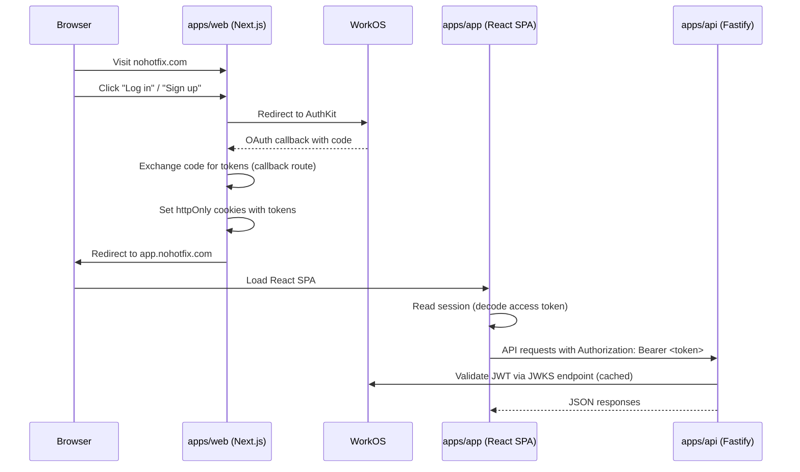
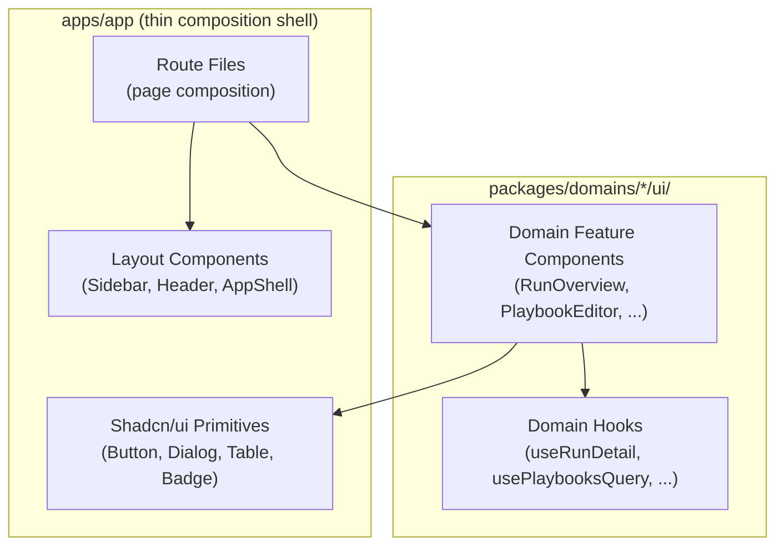
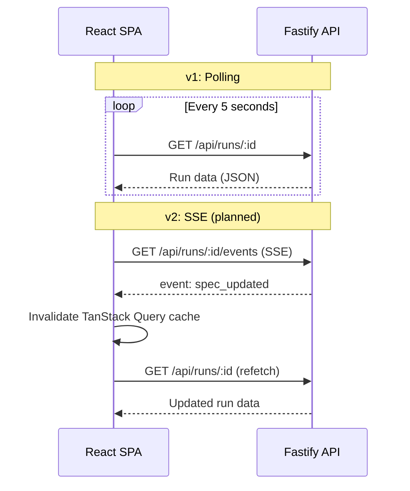

# Frontend Architecture -- NoHotfix v1

_Extracted from [docs/development/technical-architecture.md](./technical-architecture.md). See also: [Domain Architecture](./domain-architecture.md) for co-located UI details, [Coding Architecture](./coding-architecture.md) for conventions and dependency rules._

---

## Table of Contents

1. [Two Applications](#two-applications)
2. [Auth Flow](#auth-flow)
3. [Next.js App (apps/web)](#nextjs-app-appsweb)
4. [React SPA (apps/app)](#react-spa-appsapp)
5. [Domain Package Usage in Frontend](#domain-package-usage-in-frontend)
6. [API Client Layer](#api-client-layer)
7. [State Management Strategy](#state-management-strategy)
8. [Component Architecture](#component-architecture)
9. [Real-Time Strategy](#real-time-strategy)

---

## Two Applications

NoHotfix's frontend is split into two distinct applications deployed to separate Vercel projects on different subdomains:

| Application | Technology                                      | Purpose                                                 | Hosting                                   |
| ----------- | ----------------------------------------------- | ------------------------------------------------------- | ----------------------------------------- |
| `apps/web`  | Next.js 15 (App Router)                         | Landing pages, marketing, pricing, WorkOS auth callback | Vercel (`nohotfix.com`)                   |
| `apps/app`  | React + Vite + TanStack Router + TanStack Query | All authenticated, post-login application UI            | Vercel (`app.nohotfix.com`, static build) |

_Rationale (ADR-001)_: Landing pages need SSR for SEO and fast initial paint. The authenticated app is a rich interactive SPA that benefits from client-side routing, client-side state, and TanStack Query's caching model. Mixing these concerns in a single Next.js app would create unnecessary complexity.

_Rationale (ADR-009)_: Separate Vercel projects allow independent deployments -- a marketing page change does not require rebuilding the app, and vice versa. The subdomain split provides a clean security boundary for cookie scoping.

---

## Auth Flow



**Session management details:**

1. WorkOS AuthKit issues access + refresh tokens after authentication
2. The Next.js auth callback route (`apps/web/src/app/auth/callback/route.ts`) stores tokens in secure, httpOnly cookies
3. The React SPA reads session status via a `/api/auth/session` endpoint on the Next.js app (or by decoding the access token client-side if it is a non-httpOnly cookie)
4. The SPA attaches the access token to every API request via an `Authorization: Bearer` header
5. Token refresh is handled transparently by the API client layer (401 response triggers a refresh attempt)

**Key auth files:**

- `apps/web/src/app/auth/callback/route.ts` -- WorkOS OAuth callback
- `apps/web/src/app/auth/logout/route.ts` -- Session destruction
- `apps/app/src/lib/session.ts` -- SPA session management
- `apps/api/src/shared/middleware/auth.ts` -- JWT validation middleware

---

## Next.js App (`apps/web`)

### Page Structure

```
apps/web/src/app/
|-- layout.tsx                       # Root layout (marketing chrome)
|-- page.tsx                         # Landing page (/)
|-- pricing/page.tsx                 # Pricing page
|-- auth/
|   |-- callback/route.ts           # WorkOS OAuth callback (API route)
|   |-- logout/route.ts             # Session destruction (API route)
|-- (legal)/
    |-- privacy/page.tsx
    |-- terms/page.tsx
```

The Next.js app has **no authenticated pages**. Its sole authenticated responsibility is the auth callback route that exchanges the WorkOS authorization code for tokens and redirects to the SPA.

### Technology

- Next.js 15 with App Router
- Server-side rendering for SEO
- Minimal client-side JavaScript
- May selectively import domain UI components (e.g., from `@nohotfix/domain-identity/ui` for a pricing page that references member roles) but this is limited

### Key Files

- `apps/web/next.config.ts` -- Next.js configuration
- `apps/web/src/app/auth/callback/route.ts` -- The auth callback that handles the WorkOS redirect
- `apps/web/src/app/auth/logout/route.ts` -- Destroys the session

---

## React SPA (`apps/app`)

### Technology Stack

- **React** 18+ with JSX transform (no `import React` needed)
- **Vite** for bundling and dev server (`apps/app/vite.config.ts`)
- **TanStack Router** for file-based client-side routing
- **TanStack Query** for server state management
- **Tailwind CSS** for styling
- **Shadcn/ui** (Radix UI-based) for headless component primitives
- Deployed as a static build to Vercel

### Route Structure

```
apps/app/src/routes/
|-- __root.tsx                       # Root layout (sidebar, org switcher, subscription banners)
|-- _authenticated.tsx               # Auth guard layout -- redirects to login if no valid session
|-- _authenticated/
|   |-- index.tsx                    # Dashboard / home screen
|   |-- playbooks/
|   |   |-- index.tsx                # Playbook list
|   |   |-- new.tsx                  # Create playbook form
|   |   |-- $playbookId.tsx          # Playbook editor (Admin) / read-only view (Member)
|   |-- runs/
|   |   |-- index.tsx                # Active runs list
|   |   |-- start.tsx                # Start run form (playbook selection, pre-assignment)
|   |   |-- $runId.tsx               # Run overview
|   |-- history/
|   |   |-- index.tsx                # Run history list with filters
|   |   |-- $runId.tsx               # Read-only run detail (compliance view)
|   |-- spec-library/
|   |   |-- index.tsx                # Spec library browse/search (Admin)
|   |   |-- new.tsx                  # Create library spec (Admin)
|   |   |-- $specId.tsx              # Spec detail/edit (Admin)
|   |-- settings/
|       |-- index.tsx                # Settings layout
|       |-- general.tsx              # Org settings (Admin: edit name; Member: read-only)
|       |-- members.tsx              # Member management (Admin)
|       |-- account.tsx              # Account settings (all roles)
|       |-- billing.tsx              # Billing management (Admin)
```

### Route Guards

The `_authenticated.tsx` layout checks for a valid session on mount. If no valid session exists, the user is redirected to the Next.js login page.

Role-based guards are applied at the route level:

```typescript
// Example: Admin-only route guard
export const Route = createFileRoute('/_authenticated/spec-library/')({
  beforeLoad: ({ context }) => {
    if (context.auth.role !== 'admin') {
      throw redirect({ to: '/' });
    }
  },
});
```

### RBAC in the UI

| Action                          | Admin | Member |
| ------------------------------- | ----- | ------ |
| Create/edit playbooks           | Yes   | No     |
| Manage spec library             | Yes   | No     |
| Start a run                     | Yes   | Yes    |
| Execute specs (pass/fail/skip)  | Yes   | Yes    |
| Make go/no-go decision          | Yes   | No     |
| Abandon a run                   | Yes   | No     |
| Manage org settings and members | Yes   | No     |
| Access billing                  | Yes   | No     |

### Key Files

- `apps/app/vite.config.ts` -- Vite build configuration
- `apps/app/src/main.tsx` -- Entry point
- `apps/app/src/router.tsx` -- TanStack Router configuration
- `apps/app/src/routeTree.gen.ts` -- Generated route tree (hand-written stub, `vite dev` overwrites with real generated file)
- `apps/app/src/api/query-keys.ts` -- TanStack Query key factory
- `apps/app/src/lib/session.ts` -- Token management (getAccessToken, refreshAccessToken, logout)

---

## Domain Package Usage in Frontend

The React SPA (`apps/app`) imports from domain packages via **two entry points** per package -- domain logic and co-located UI:

| Domain Package     | Logic imports (`@.../domain-<ctx>`)        | UI imports (`@.../domain-<ctx>/ui`)                                                          |
| ------------------ | ------------------------------------------ | -------------------------------------------------------------------------------------------- |
| `domain-identity`  | Role constants, membership types           | `MemberList`, `InviteMemberDialog`, `useMembersQuery`                                        |
| `domain-billing`   | `SubscriptionStateService`, `TrialService` | `SubscriptionBanner`, `PlanBadge`, `useSubscriptionQuery`, `useCheckoutMutation`             |
| `domain-authoring` | Validation rules for playbook/spec fields  | `PlaybookEditor`, `SectionList`, `SpecCard`, `usePlaybooksQuery`, `useSpecLibrary`           |
| `domain-execution` | `RunStateMachine`, `SpecStateMachine`      | `RunOverview`, `SpecExecutionPanel`, `DecisionDialog`, `useRunDetail`, `useDecisionMutation` |
| `domain-audit`     | --                                         | `RunHistoryTable`, `ChangelogTimeline`, `useRunHistoryQuery`, `useChangelogQuery`            |
| `shared`           | Zod schemas, error codes, constants        | --                                                                                           |

### Example: Run Page Composition

This example shows how `apps/app` acts as a thin composition shell. The route file imports domain UI components and composes them into a page:

```typescript
// apps/app/src/routes/_authenticated/runs/$runId.tsx
import { RunStateMachine } from '@nohotfix/domain-execution';
import { RunOverview, DecisionDialog, SpecStatusBadge } from '@nohotfix/domain-execution/ui';
import { useRunDetail, useDecisionMutation } from '@nohotfix/domain-execution/ui';

function RunPage() {
  const { runId } = Route.useParams();
  const { data: run } = useRunDetail(runId);
  const decisionMutation = useDecisionMutation(runId);

  return (
    <PageLayout>
      <RunOverview run={run} />
      {run.status === 'awaiting_decision' && (
        <DecisionDialog onSubmit={decisionMutation.mutateAsync} />
      )}
    </PageLayout>
  );
}
```

### Example: Using Domain Logic in Frontend

Domain logic (state machines, validation rules) is shared between backend and frontend:

```typescript
// apps/app/src/routes/_authenticated/runs/$runId.tsx
import { RunStateMachine } from '@nohotfix/domain-execution';

const stateMachine = new RunStateMachine();
const isTerminal = stateMachine.isTerminal(run.status);
const canDecide = run.status === 'awaiting_decision';
```

### What stays in `apps/app` vs. what moves to domain `ui/`

| Layer                        | Location                                | Responsibility                                                 | Examples                                                                       |
| ---------------------------- | --------------------------------------- | -------------------------------------------------------------- | ------------------------------------------------------------------------------ |
| **Domain UI components**     | `packages/domains/<ctx>/ui/components/` | Feature-level components tightly coupled to domain concepts    | `RunOverview`, `SpecExecutionPanel`, `PlaybookEditor`, `SubscriptionBanner`    |
| **Domain UI hooks**          | `packages/domains/<ctx>/ui/hooks/`      | TanStack Query hooks for domain API endpoints, mutation logic  | `useActiveRuns()`, `usePlaybooksQuery()`, `useDecisionMutation()`              |
| **App-global UI primitives** | `apps/app/src/components/ui/`           | Headless, domain-agnostic primitives (shadcn/ui)               | `Button`, `Dialog`, `Table`, `Badge`, `Card`                                   |
| **App layout components**    | `apps/app/src/components/layout/`       | Application shell, navigation, banners                         | `Sidebar`, `Header`, `AppShell`                                                |
| **Page composition**         | `apps/app/src/routes/`                  | Route definitions that compose domain UI components into pages | `runs/$runId.tsx` imports `RunOverview` + `DecisionDialog` and wraps in layout |

---

## API Client Layer

The API client is a shared package (`@nohotfix/api-client`) that centralizes authenticated fetching, automatic 401 retry with token refresh, error parsing, and TanStack Query hook helpers.

### Package: `packages/api-client`

```typescript
// packages/api-client/src/client.ts
export interface TokenManager {
  getToken(): Promise<string | null>;
  refreshToken(): Promise<string | null>;
}

export class ApiClient {
  constructor(config: { baseUrl: string; tokenManager: TokenManager }) {}

  async request<T>(
    method: string,
    path: string,
    options?: {
      body?: unknown;
      schema?: z.ZodType<T>;
      signal?: AbortSignal;
    },
  ): Promise<T>;

  async get<T>(path, opts?): Promise<T>;
  async post<T>(path, body?, opts?): Promise<T>;
  async patch<T>(path, body?, opts?): Promise<T>;
  async delete<T>(path, opts?): Promise<T>;
}
```

**Key behaviors:**

- Adds `Authorization: Bearer <token>` header via `tokenManager.getToken()`
- On 401: calls `tokenManager.refreshToken()`, retries once with new token
- On non-OK: parses `{ error, message }` from response body, throws `ApiError`
- Optional Zod `.parse()` on success response (pass-through if no schema)

### API Client Context (Dependency Injection for Domain Hooks)

The `ApiClient` is injected into domain hooks via React context, provided by `@nohotfix/api-client`:

```typescript
// packages/api-client/src/hooks.tsx
export const ApiClientProvider: FC<{ client: ApiClient; children: ReactNode }>;
export function useApiClient(): ApiClient; // throws if no provider
```

The app wires it up at the root:

```typescript
// apps/app/src/app.tsx
import { ApiClient, ApiClientProvider } from '@nohotfix/api-client';

import { tokenManager } from './lib/session.js';

const apiClient = new ApiClient({ baseUrl: API_URL, tokenManager });
// Wraps the app in <ApiClientProvider client={apiClient}>
```

### Generic Query/Mutation Hooks

Domain hooks use `useApiQuery` and `useApiMutation` from `@nohotfix/api-client` instead of raw `useQuery`/`useMutation`:

```typescript
// packages/api-client/src/hooks.tsx
export function useApiQuery<T>(options: {
  queryKey: readonly unknown[];
  path: string;
  schema?: z.ZodType<T>;
  enabled?: boolean;
  staleTime?: number;
  retry?: boolean | number;
}): UseQueryResult<T>;

export function useApiMutation<TData, TVariables>(options: {
  method: 'POST' | 'PATCH' | 'DELETE';
  path: string | ((variables: TVariables) => string);
  schema?: z.ZodType<TData>;
  body?: ((variables: TVariables) => unknown) | undefined;
  invalidateKeys?: readonly (readonly unknown[])[];
}): UseMutationResult<TData, ApiError, TVariables>;
```

Domain hooks are now simplified:

```typescript
// packages/domains/identity/src/ui/hooks/use-user-organisations.ts
import { useApiQuery } from '@nohotfix/api-client';

export function useUserOrganisations({ queryKey }: { queryKey: readonly unknown[] }) {
  return useApiQuery<UserOrganisationDto[]>({
    queryKey,
    path: '/api/users/me/orgs',
    staleTime: 5 * 60 * 1000,
    retry: false,
  });
}
```

Domain hooks no longer accept `apiUrl` or `getAccessToken` props -- they get the `ApiClient` from context automatically.

---

## State Management Strategy

### Server State (TanStack Query)

All data from the API is managed by TanStack Query. Query keys follow a hierarchical convention:

```typescript
// Query key factory pattern (apps/app/src/api/query-keys.ts)
export const runKeys = {
  all: ['runs'] as const,
  lists: () => [...runKeys.all, 'list'] as const,
  list: (filters: RunFilters) => [...runKeys.lists(), filters] as const,
  details: () => [...runKeys.all, 'detail'] as const,
  detail: (id: string) => [...runKeys.details(), id] as const,
};
```

Polling is configured per query:

| View                           | Polling Interval | Rationale                                                |
| ------------------------------ | ---------------- | -------------------------------------------------------- |
| Run overview (specs, progress) | 5 seconds        | Concurrent tester updates need near-real-time visibility |
| Dashboard active runs          | 10 seconds       | Less time-critical than spec-level updates               |
| History list                   | No polling       | On-demand fetch, no real-time needs                      |
| Playbook editor                | No polling       | Single-author assumption in v1                           |

### Client State (minimal)

Only truly client-local state is managed outside TanStack Query:

- **UI state**: sidebar open/close, modal visibility, drag-and-drop ordering
- **Form state**: managed by React Hook Form + Zod resolver
- **Auth session**: in-memory access token + httpOnly refresh cookie (managed by `apps/app/src/lib/session.ts`)

No global client state store (no Redux, Zustand, or similar). TanStack Query's cache is the single source of truth for server data.

_Rationale_: TanStack Query's stale-while-revalidate model provides the polling-based near-real-time behavior needed for run execution. There is no client-side data complex enough to warrant a separate store.

---

## Component Architecture

### Layers



### UI Primitives (app-level)

Shadcn/ui is adopted as the headless component foundation in `apps/app/src/components/ui/`. Components are installed as source files (not a package dependency), providing accessible, composable primitives built on Radix UI and styled with Tailwind CSS:

```
apps/app/src/components/ui/
|-- Button.tsx
|-- Dialog.tsx
|-- Table.tsx
|-- Badge.tsx
|-- Card.tsx
|-- Dropdown.tsx
|-- Input.tsx
|-- ...
```

### Domain Feature Components (package-level)

Each domain package co-locates its feature components in `packages/domains/<ctx>/src/ui/components/`. These compose shadcn/ui primitives into domain-meaningful features:

```
packages/domains/execution/src/ui/components/
|-- RunOverview.tsx          # Run progress display with section/spec breakdown
|-- RunProgressBar.tsx       # Visual progress bar using SpecStateMachine
|-- SpecExecutionPanel.tsx   # Spec detail view with artifact upload, pass/fail
|-- DecisionDialog.tsx       # Go/no-go decision form with justification
|-- ArtifactUploader.tsx     # File upload with presigned URL flow
|-- SpecStatusBadge.tsx      # Status badge using SpecStateMachine for colors
|-- SectionSkipDialog.tsx
```

### Domain Hooks (package-level)

TanStack Query hooks live in `packages/domains/<ctx>/src/ui/hooks/`. Each hook encapsulates an API call, its query key, its polling interval, and any optimistic update logic:

```
packages/domains/execution/src/ui/hooks/
|-- use-active-runs.ts       # useQuery: list active runs (5s polling)
|-- use-run-detail.ts        # useQuery: full run detail (5s polling)
|-- use-start-run.ts         # useMutation: start a new run
|-- use-record-result.ts     # useMutation: record spec pass/fail/skip
|-- use-decision.ts          # useMutation: record go/no-go/abandon
|-- use-presign-upload.ts    # useMutation: get presigned URL + upload file
|-- use-claim-spec.ts        # useMutation: claim/unclaim spec
```

### Layout Components (app-level)

Application shell components in `apps/app/src/components/layout/`:

```
apps/app/src/components/layout/
|-- Sidebar.tsx
|-- Header.tsx
|-- AppShell.tsx
|-- SubscriptionBanner.tsx
```

### Page Files (app-level)

Route files in `apps/app/src/routes/` are thin page compositions. They import domain components, pass route params, and wrap content in layout shells. Minimal custom JSX.

---

## Real-Time Strategy

### v1: Polling via TanStack Query

Active run views poll the API every 5 seconds. This provides adequate near-real-time visibility for concurrent testers. The 5-second window means a tester might briefly see stale data before the next poll cycle fetches updates.

### v2: Server-Sent Events (SSE)

When concurrent usage patterns are validated and the 5-second latency becomes a pain point, the API will expose SSE endpoints for run-scoped event streams. The SPA will subscribe to these streams and invalidate TanStack Query caches on receipt of events. This is a backward-compatible addition -- the polling fallback remains.


